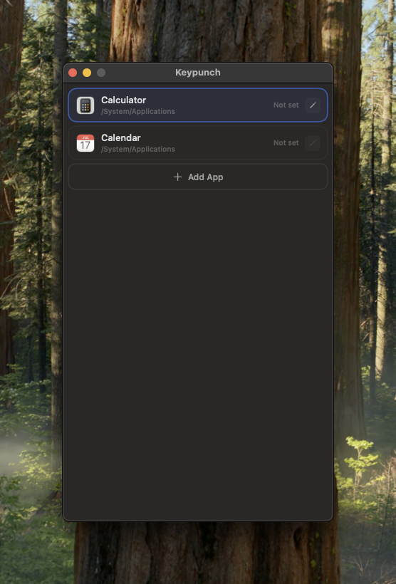

# Keypunch

A macOS menu bar app that launches applications via global keyboard shortcuts.

<p align="center">
  
</p>

## Features

- Register global keyboard shortcuts to launch any macOS application
- Menu bar icon with Show / Start at Login / Quit controls
- Settings window to add, edit, and remove shortcuts with app icons and shortcut badges
- Persistent storage — shortcuts survive app restarts
- Duplicate app detection

## Install

### Homebrew

```bash
brew install --cask mkusaka/tap/keypunch
```

### Manual Download

Download the latest `.zip` from [GitHub Releases](https://github.com/mkusaka/keypunch/releases), extract it, and move `Keypunch.app` to `/Applications`.

> **Note:** This app is not signed with an Apple Developer ID. On first launch, macOS Gatekeeper will block it. Right-click the app and select "Open" to bypass the warning, or go to System Settings > Privacy & Security to allow it.

## Requirements

- macOS 15.5+
- Xcode 16+

## Build

```bash
xcodebuild -project Keypunch.xcodeproj -scheme Keypunch -destination 'platform=macOS' build
```

## Run

Open in Xcode and press Cmd+R, or:

```bash
open "$(xcodebuild -project Keypunch.xcodeproj -scheme Keypunch -showBuildSettings | grep -m1 'BUILT_PRODUCTS_DIR' | awk '{print $3}')/Keypunch.app"
```

## Test

```bash
# All tests
xcodebuild -project Keypunch.xcodeproj -scheme Keypunch -destination 'platform=macOS' test

# Unit tests only
xcodebuild -project Keypunch.xcodeproj -scheme Keypunch -destination 'platform=macOS' -only-testing:KeypunchTests test

# UI tests only
xcodebuild -project Keypunch.xcodeproj -scheme Keypunch -destination 'platform=macOS' -only-testing:KeypunchUITests test
```

## Tech Stack

- SwiftUI (`NSStatusItem` + `NSWindow`)
- [KeyboardShortcuts](https://github.com/sindresorhus/KeyboardShortcuts) for global hotkey registration
- `@Observable` for state management
- UserDefaults for persistence

## License

MIT
